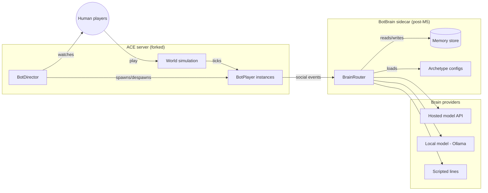
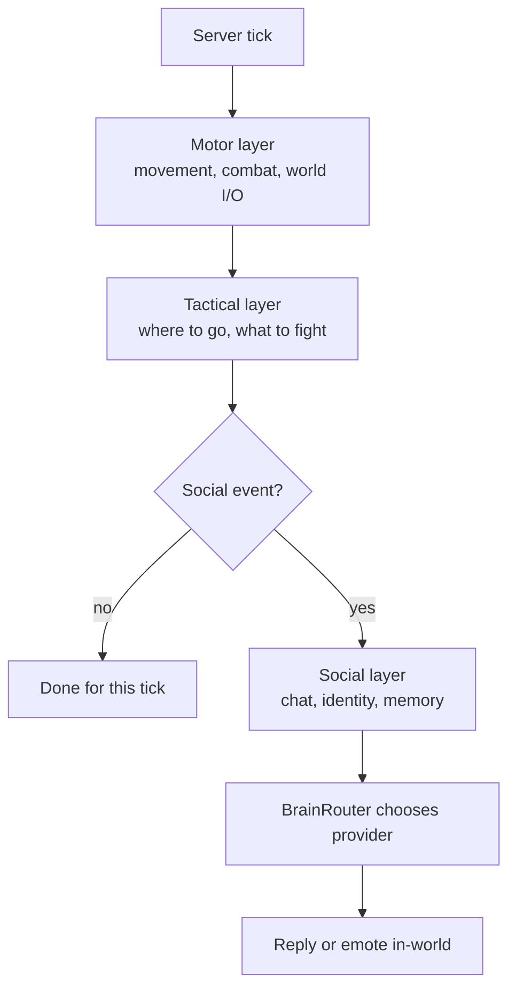
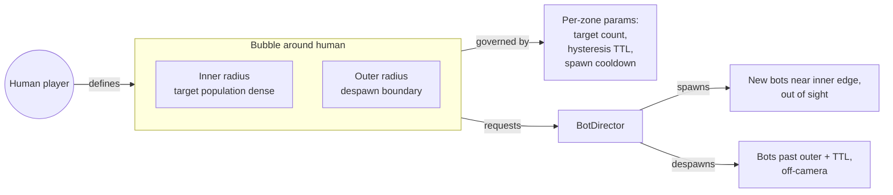
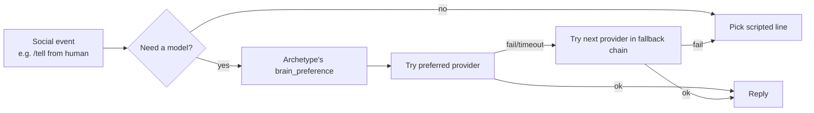

# Architecture diagrams

Lightweight Mermaid diagrams to support [`architecture.md`](architecture.md).
Kept in a separate file so the prose doc stays readable and the diagrams
are easy to find when something changes.

## Component overview

## Per-bot tick layering

## Bubble model

## Brain routing

These diagrams are illustrative, not normative. When the docs and the
diagrams disagree, the docs win and the diagram is wrong.
